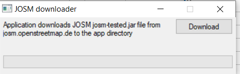

This is a new JOSM updater, created with AutoIt.  
Cudos to https://www.autoitscript.com/forum/topic/162445-_inetgetgui-and-_inetgetprogress/. 

# How to
1. Download updateJosmTested.exe application to your computer.
2. Place it to **where you want josm-tested.jar to be downloaded**.
3. Click "Download" button.  

4. josm-tested.jar gets uploaded to the application directory. 